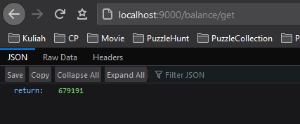
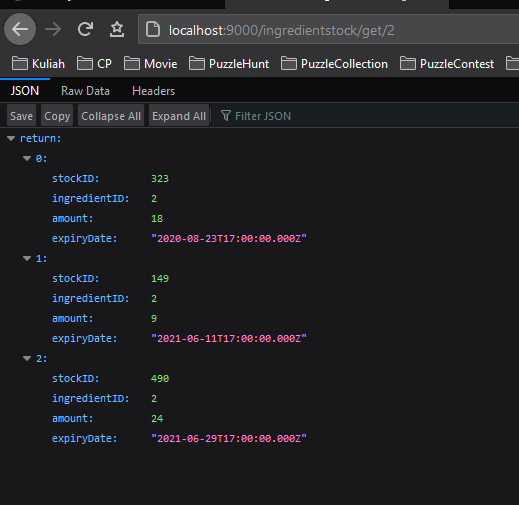
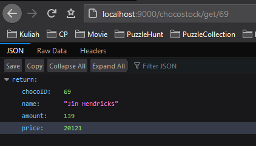
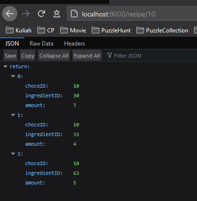
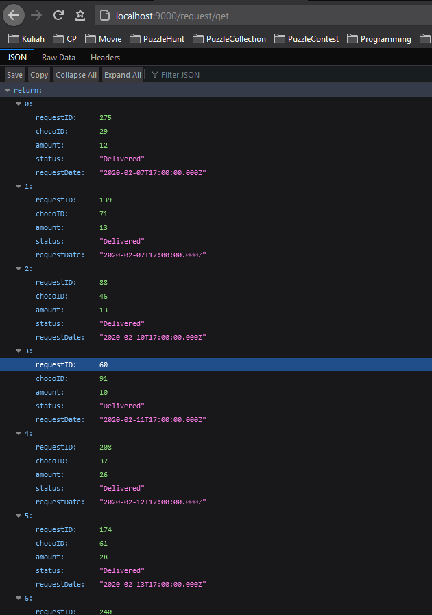

# Choco-Factory-WebService

1 of 4 part from Chocolate Factory Website

## Prerequisites

1. Java 1.9+
1. [Jaxws-ri runtime](https://mvnrepository.com/artifact/com.sun.xml.ws/jaxws-rt/2.3.3) - [Direct Link](https://repo1.maven.org/maven2/com/sun/xml/ws/jaxws-rt/2.3.3/jaxws-rt-2.3.3.jar)
1. [MySQL connector](https://mvnrepository.com/artifact/mysql/mysql-connector-java) - [Direct link](https://repo1.maven.org/maven2/mysql/mysql-connector-java/8.0.22/mysql-connector-java-8.0.22.jar)

## Setup

1. Populate database with `chocofactory20201111.sql`
1. Download [jaxws-ri](https://mvnrepository.com/artifact/com.sun.xml.ws/jaxws-rt/2.3.3)
1. Extract, copy all files under `lib` to `<repo_root>/WebContent/WEB-INF/lib`

## Compiling and Running

1. Compile all java file under `<repo_root>/src`
1. Run `com.chocofactory.webservice.FactoryPublisher`
1. Web Service will be hosted in [localhost:8080](http://localhost:8080/)

## Project Structure

```
src
└───com
    └───chocofactory
        └───webservice
            │   FactoryDAO.java
            │   FactoryPublisher.java
            │   jdbc.properties
            │
            ├───balance
            │       Balance.java
            │       BalanceSOAP.java
            │       IBalanceSOAP.java
            │
            ├───chocostock
            │       ChocoStock.java
            │       ChocoStockSOAP.java
            │       IChocoStockSOAP.java
            │
            ├───ingredientstock
            │       IIngredientStockSOAP.java
            │       IngredientAmount.java
            │       IngredientStock.java
            │       IngredientStockSOAP.java
            │
            ├───recipe
            │       IRecipeSOAP.java
            │       Recipe.java
            │       RecipeSOAP.java
            │
            ├───request
            │       IRequestSOAP.java
            │       Request.java
            │       RequestSOAP.java
            │
            └───user
                    IUserSOAP.java
                    User.java
                    UserSOAP.java
```

## Database Schema

ChocoRequest(RequestID, ChocoID, Amount, Status, RequestDate)
ChocoStock(ChocoID, Amount)
IngredientStock(StockID, IngredientID, Amount, ExpiryDate)
Recipe(ChocoID, IngredientID, Amount)
Balance(Balance)

## Services

### Balance



1. GET /balance

> get current balance
> output: `integer`

2. POST /balance/add

```
{
  "amount": 100
}
```

> add x money to balance
> output: `boolean`

3. POST /balance/update

```
{
  "amount": 100
}
```

> update balance to x money
> output: `boolean`

### Ingredient Stock



1. GET /ingredientstock/:id?notexpired=true

> get ingredients stock of supplied id = ingredientID (optional: notexpired)
> output: `array of IngredientStock`

```
IngredientStock: {
  stockID: integer,
  ingredientID: integer,
  amount: integer,
  expiryDate: DateTime
}
```

2. GET /ingredientstock/total/:id

> get sum of ingredientstock of the supplied id
> output: `integer`

2. GET /ingredientstock/total/

> get sum of ingredientstock of all ingredients
> output: `array of {ingredientID: integer, amount: integer}`

3. POST /ingredientstock/add/:ingredientID

```
{
  "amount": 10,
}
```

> add stock of ingredient of the supplied id
> output: `boolean`

4. POST /ingredientstock/update/:stockid

```
{
  "amount": 10,
}
```

> update stock of ingredient of the supplied id
> output: `boolean`

5. POST /ingredientstock/delete/:stockid

> deletes stock of ingredient of supplied id from database (proceed with caution)
> output: `boolean`

### Choco Stock



1. GET /chocostock/:id

> get stock of chocolate with supplied id
> output: `integer`

2. GET /

> get stock of all chocolate
> output: `list of {chocoid: integer, amount: integer}`

### Recipe



1. GET /recipe/:id

> get recipe of a chocolate with supplied id
> output: `{chocoID: integer, ingredientID: integer, amount: integer}`

2. POST /recipe/add

```
{
  "chocoid":101,
  "name":"Ali baba",
  "price":5000,
  "ids":[1,31,59],
  "amounts":[2,5,7]
}
```

> add a recipe of a chocolate with id = chocoid.
> recipe consist of array of ingredient id = ids with each amount = amounts.
> output: `integer` id

### Request



1. GET /request/:id

> get request with supplied id
> output: `Request`

```
Request: {
  requestID: integer,
  chocoID: integer,
  amount: integer,
  status: String, (Pending | Delivered)
  requestDate: DateTime
}
```

2. GET /request

> get all request
> output: `array of Request`

3. GET /request/status/:id

> get status of a request with supplied id
> output: `String` (Pending | Delivered)

4. POST /request/add

```
{
  "chocoid": 3,
  "amount": 123
}
```

> add a new request
> output: `boolean`

5. POST /request/deliver/:id

```
{
  "id": 72
}
```

> deliver a request with supplied id
> output: `boolean`

## Author

[Jonathan Yudi Gunawan](https://github.com/JonathanGun/) - 13518084

## Acknowledgement

This project is made to fulfill IF3110 Website Development course
